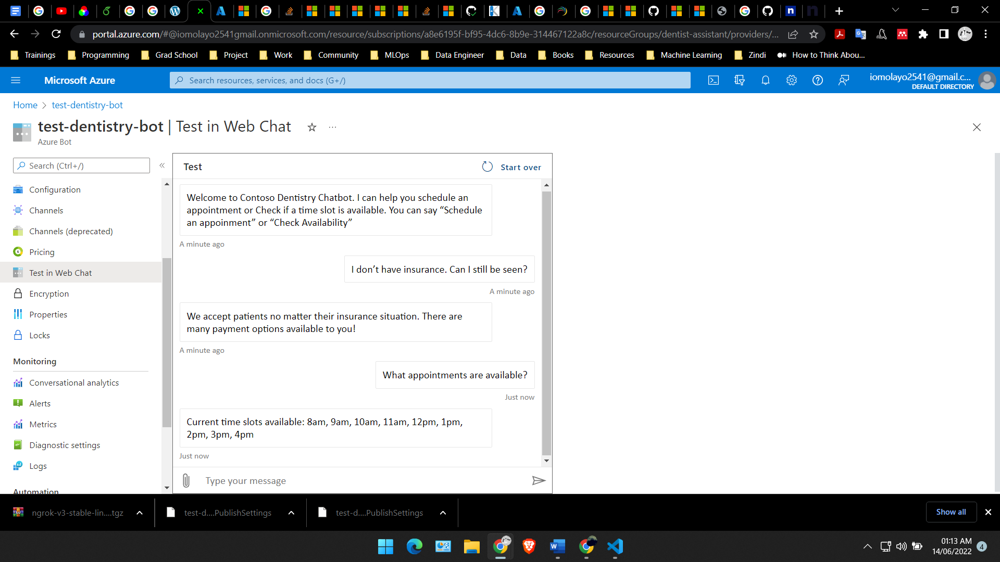
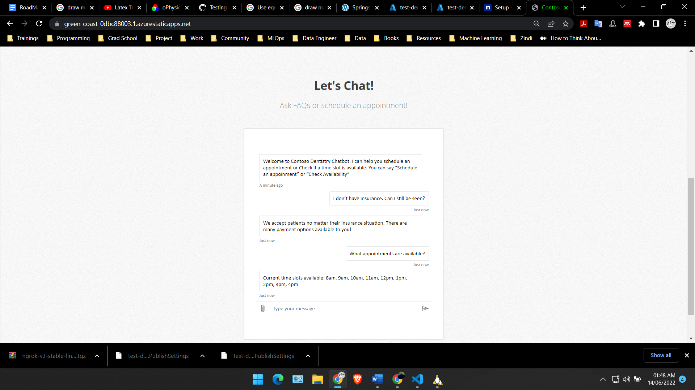

# Azure Bot Dental Office Virtual Assistant

In this project, I created a customer support chatbot that lives on a dentist website. The bot will use Azure QnA Maker and LUIS to answer patient questions and help them schedule appointments.

## Project Architecture

A diagram of the application architecture is below:

## Getting Started

- Download and install [Visual Studio Code](https://code.visualstudio.com/download)
- Download and install [NodeJS](https://nodejs.org/en/)
- Download and install the [Bot Framework Emulator](https://github.com/Microsoft/BotFramework-Emulator/releases/tag/v4.13.0)
- Fork the repository to create your own GitHub repository for this project or use “git clone” to download the repository for local development.

### Instructions

#### Create the Bot Application
The Node.js bot application is the hub that connects all of our services into a single conversational interface. The starter code for this is in the ContosoDentistryChatBot folder in the project starter repository. It contains logic that determines how the conversation flows between patients and the ContosoDentristyWebsite Bot. Some of that logic is based on the feedback it gets from the connected services.

- Create an Azure Bot resource in the Azure Portal
- Create an App Service resource in the Azure Portal
- Set the Azure Bot resource's messaging endpoint URL to the App Service's endpoint URL (don't forget to add /api/messages to the of the endpoint URL) in the Azure Bot configuration settings.
- Create a Continuous deployment Reference ( Github CI / CD) in the Deployment Center of the App Service to the ContosoDentistryChatBot folder in your GitHub repo.
- Add the Azure Bot Resource App ID and Password to the ContosoDentistryChatBot .env file
- In the ContosoDentistryChatBot directory of the repo, use the command below to install dependencies.
```bash
npm install
```
- Use the command below to start ContosoDentistryChatBot.
```bash
npm start
```

#### Create A QnA Maker Resource

The QnA Maker Knowledge base will contain FAQs about the dentist office and allow our bot to answer them when the patient asks. QnA Maker uses NLP to interpret user utterances even if it has never seen the exact phrasing before.

- Add a QnA Maker resource to the resource group.
- Navigate to the QnA Maker portal.
- Create a knowledge base.
- Load dentist FAQs into the knowledge base from FAQ.tsv in the ContosoDentistryFAQs folder of the starter code repository.
- Publish the knowledge base.
- Copy the QnA maker keys to the ContosoDentistryChatBot .env file and the bot app service’s application settings.

#### Create the LUIS Resource

LUIS gives our bot application the ability to determine the intent of the patient’s utterances as well as extract entities such as the time a patient requests an appointment. LUIS will help our app handle requests related to our Dentist Scheduler App.

- Add a language understanding resource to the resource group.
- Navigate to the LUIS portal.
- Create `GetAvailability` and `ScheduleAppointment` intents.
- Add example user input for both - labeling date-time entities where appropriate.
- Train and publish the LUIS model.
- Copy the LUIS keys to the bot’s env file and the bot app service’s application settings.

#### Deploy the Dentist Scheduler App

The Dentist Scheduler app represents a third-party API whose functionality can be integrated into our conversational interface.

- Add a Web App resource to the resource group.
- Create a Continuous deployment Reference ( Github CI / CD) in the Deployment Center for the Web App resource to the ContosoDentistryScheduler folder in the starter repository.
- Copy the ContosoDentistrySchedulerAPI endpoint to the bot’s .env file and the bot app service’s application settings.

#### Verify Bot Configuration

Once all of our services are up and running it is time to connect them all to our bot. Verify that the environment variables that have been collected in the previous steps are correct by testing the application locally and in Azure.

- Test your changes locally.
- Deploy your changes by pushing to GitHub.
- Test in Web Chat in the Azure console.



#### Testing the bot using Bot Framework Emulator

[Bot Framework Emulator](https://github.com/microsoft/botframework-emulator) is a desktop application that allows bot developers to test and debug their bots on localhost or running remotely through a tunnel.

- Install the Bot Framework Emulator version 4.9.0 or greater from [here](https://github.com/Microsoft/BotFramework-Emulator/releases)

##### Connect to the bot using Bot Framework Emulator

- Launch Bot Framework Emulator
- File -> Open Bot
- Enter a Bot URL of `http://localhost:3978/api/messages`

## Deploy the bot to Azure

#### Create The Dentist Website

The final step is to create a website for our dentist and deploy our bot to it.

- Add a static web app resource to the resource group.
- Create Continuous deployment Reference ( Github CI / CD) for the Static Web App resource to the ContosoDentistryWebsite folder in your starter repository (this contains the dentist website code).
- Copy the generated HTML from the bot into the website - the Web Chat code from the bot channels interface in the bot service.
- Paste the Web Chat code into the webpage.
- Push to GitHub to deploy.



## License

See [License](LICENSE.txt) file for more details.
